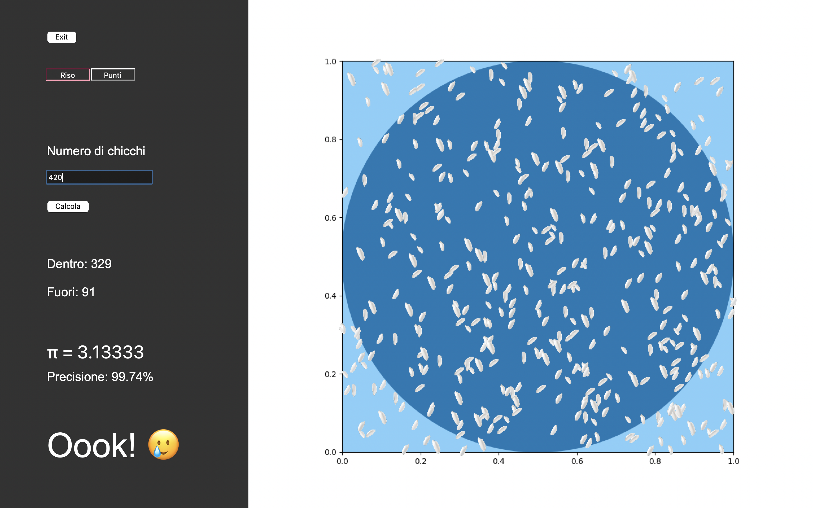
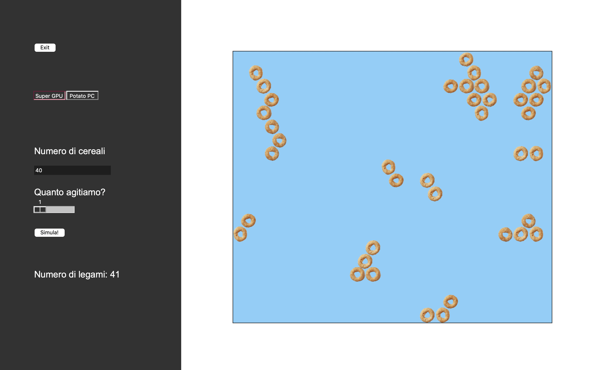

# Trieste Next 2023
Material for the SISSA stand, at the Trieste Next 2023 popular science initiative. With a general theme about quantum phenomena you can hold with your hands (or see with your eyes, in the regular life), the main focus of our activites verged towards superconductivity, naturally following the research activity of the group.

## `DrawRiceGetPi/ricepie.py`
A very basic Montecarlo simulation to compute the value of $\pi$, from statistical principles. The idea is to 
*(a)* "draw" rice (in the sense of drawing a dice) in a square box, with a printed inscripted circle and *(b)* count how much grains had fallen inside the circle and how much outside.     
The former integer would be proportional to the area of the circle $\pi r^2 = \frac{\pi \ell^2}{4}$, where $\ell$ is the length of the side of the square box. The total number of grains is instead proportional to the area of the whole box $\ell^2$, so the ratio between the two integers just gives $\frac{\pi}{4}$.    
The script launches a nice application that allows the user to select the amount of grains to "draw" (and _draws_ them in the right panel!). Then it computes the statistical estimate of $\pi$ and prints it on the left, together with the accuracy with respect to the exact value and some other info about the effort for the computation.    
Overall the idea is to give a flavour of what mathematical and computational modeling of reality feels, what are the trade-offs and how it can be helpful to make experiments well beyond the "experimental feasibility" (represented by our handmade rice-box, at the stand). It introduces what is the concept behind Montecarlo simulations, that would be helpful for possible in depth explanations of the following experience.

<kbd> 

## `SuperCheerios/breakfast.py`
A more sophisticated case for the Montecarlo technique. We simulate here the self-assembly of cereals in a bowl of water (milk?). For details on the specific water physics at play please take a look to [this pop-science video](https://youtu.be/mbKAwk-OG_w?si=RZitwRD6uLqf2kHI) or the [original paper](
https://doi.org/10.48550/arXiv.cond-mat/0411688) it is based on.    
The simulation amounts to a simple Metropolis scheme, to generate equilibrium configurations of the cereals, assuming a very simple model for their water-mediated attraction: a gain in energy whenever there is contact between two flakes. The temperature, entering the statistical weight, would just represent the amount of "shaking" one applies to the bowl containing the cereal. To make the simulation the most credible, we tuned the Markovian update as to avoid abrupt changes from one configuration to the next, at the expense of sampling efficiency (which we do not target in any way, as the aim is visual in nature).    
The experience is called "Super Cheerios" since we leveraged it as a simple and effective metaphor for the lattice-mediated attraction in superconducting materials. The cereals act as the electrons in the material, the water takes the role of the lattice (or in general, the _medium_ in which the particles lie). The water-mediated attraction gives rise to _pairing_ of the cereals/electrons. With a slight logical jump we totally avoid the discourse on fermions and bosons, and just go directly to relate the extensive self-assembly of the cereals, to the condensation of Cooper pairs in a superconductor. Then all the practical experiments with critical drag velocity, critical "shaking", etc. would map to critical current, critical temperature, etc.    
Again the script launches a window-based application, allowing for a nice visualization of the Markov chain, with _interactive_ selection of the "shaking" strength. It also takes care of resetting the simulation if one changes the number of cereals in the bowl. Finally it features a "potato PC" option, which disables the "photorealistic" render of the cereals and falls-back to minimal yellow donuts.

<kbd> 

## Software requirements
- Python 3 (suggested > 3.11)
- MatPlotLib (whatever pip3 ships)
- Numpy (whatever pip3 ships)
- Tkinter (*)

   \* In principle Tkinter should be natively shipped by regular Python installations, but we found some challenges to make it work on almost all systems. In particular on (brewed) macOS we suggest to avoid tinkering with pip3 or other pythonic ways of obtaining it and instead just run `brew install python-tk`. It will just make it available inside your brewed Python. Similarly on Ubuntu running `sudo apt-get install python3-pil.imagetk` should do the trick. Python on Windows is the usual mystery, but if you go with the official binary release, and respect the minimum version reported above, you should be blessed. If you are on Conda/Anaconda, then you're on your own, sorry.

<kbd> © 2023 | Gabriele Bellomia, Samuele Giuli